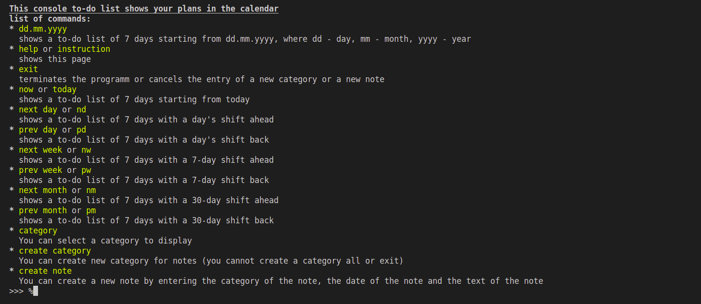
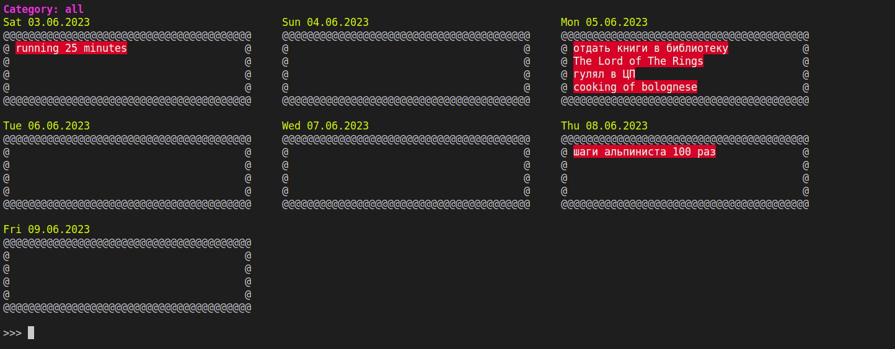
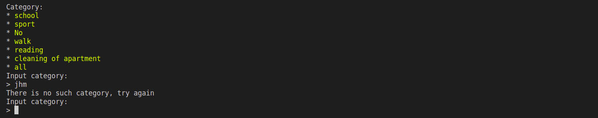
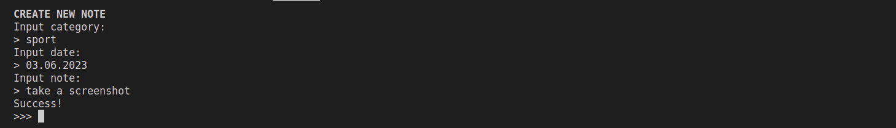
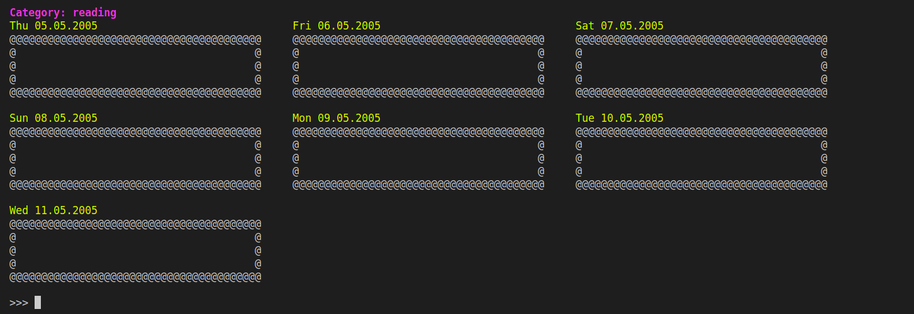
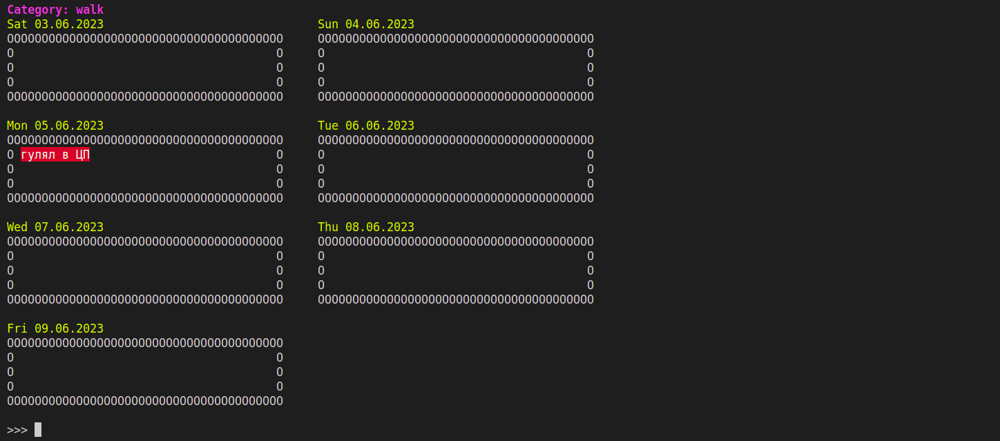

# ToDoConsole

- Stack `Python`, `SQL`
- to run `python3 main.py`

## Description
Консольный список дел. 

- А тут только гномы. (но он один)

- А тут только гномы. (но он один)

- А тут только гномы. (но он один)

- А тут только гномы. (но он один)

- А тут только гномы. (но он один)

- А тут только гномы. (но он один)

